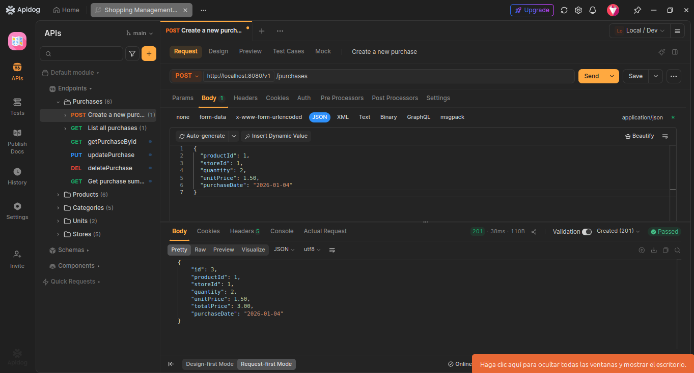
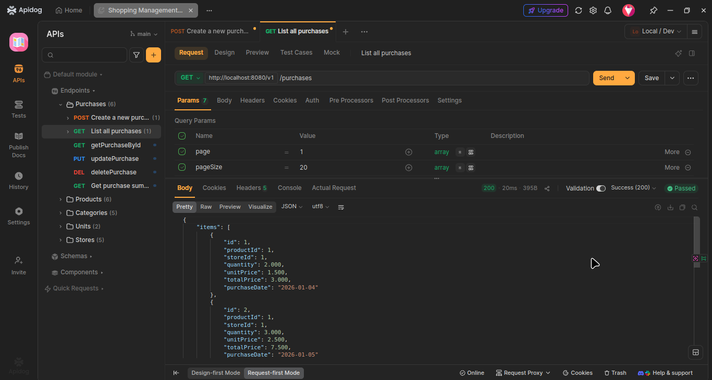
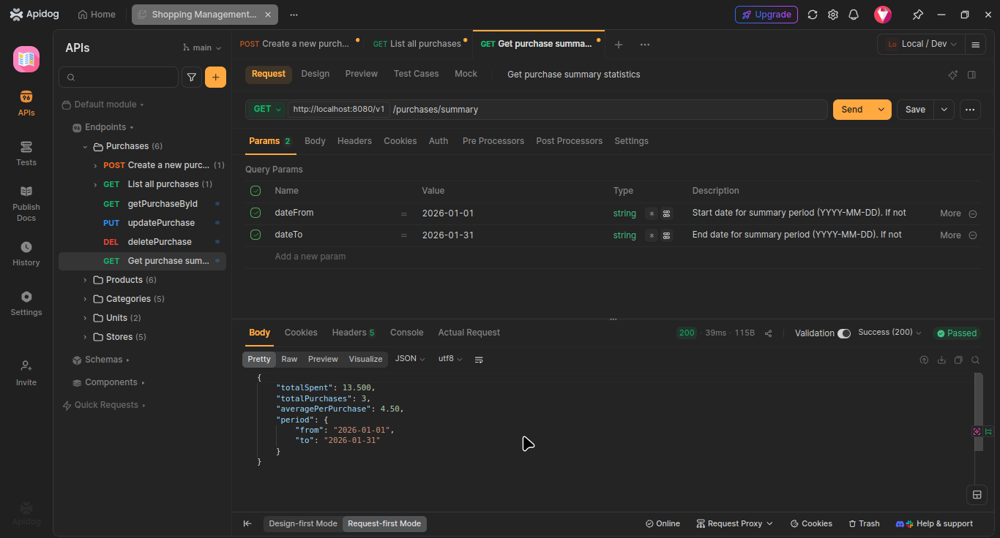
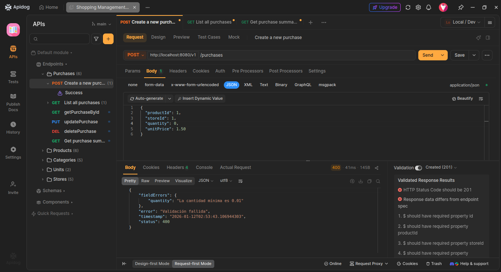
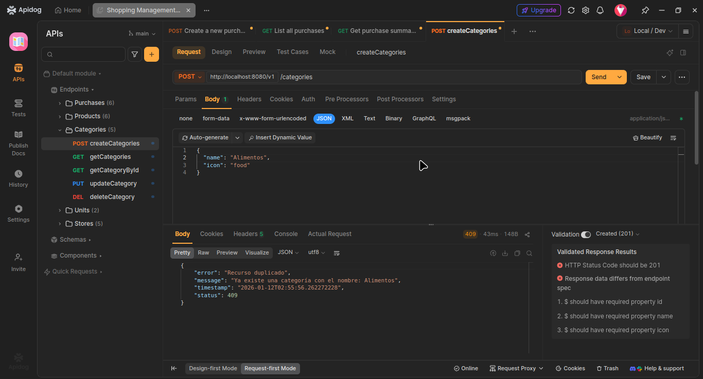
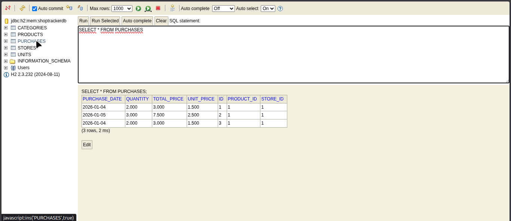

# 🛒 ShopTracker API

API REST para registro y análisis de compras personales, desarrollada con **Spring Boot 4** y arquitectura en capas.

[](https://www.oracle.com/java/)
[](https://spring.io/projects/spring-boot)
[](LICENSE)

---

## 📋 Tabla de Contenidos

- [Demo en Vivo](#-demo-en-vivo)
- [Características](#-características)
- [Tecnologías](#-tecnologías)
- [Arquitectura](#-arquitectura)
- [Instalación](#-instalación)
- [Uso](#-uso)
- [Endpoints](#-endpoints)
- [Testing](#-testing)
- [Roadmap](#-roadmap)
- [Autor](#-autor)

---

## 🌐 Demo en Vivo

La API está desplegada y disponible públicamente en Railway:

**Base URL:** `https://shoptracker-api-production.up.railway.app`

### Ejemplos de uso:

**Listar unidades de medida:**
```bash
curl https://shoptracker-api-production.up.railway.app/v1/units
```

**Listar categorías:**
```bash
curl https://shoptracker-api-production.up.railway.app/v1/categories
```

**Crear una categoría:**
```bash
curl -X POST https://shoptracker-api-production.up.railway.app/v1/categories \
  -H "Content-Type: application/json" \
  -d '{"name":"Alimentos","icon":"food"}'
```

**Obtener estadísticas de compras:**
```bash
curl https://shoptracker-api-production.up.railway.app/v1/purchases/summary
```

> 💡 **Nota:** La base de datos se reinicia periódicamente en el plan gratuito de Railway. Los datos son temporales para propósitos de demo.

---

## ✨ Características

- ✅ **CRUD completo** de categorías, productos, tiendas y compras
- ✅ **Validaciones robustas** (formato + negocio)
- ✅ **Manejo de errores profesional** con excepciones personalizadas
- ✅ **Paginación** en listados
- ✅ **Cálculo automático** de precio total
- ✅ **Estadísticas** de gastos por período
- ✅ **Arquitectura limpia** en capas
- ✅ **Tests unitarios** con JUnit 5 y Mockito
- ✅ **Multi-entorno** (desarrollo/producción)
- ✅ **Base de datos H2** (desarrollo)
- ✅ **Desplegado en Railway** con PostgreSQL

---

## 🛠️ Tecnologías

### Backend
- **Java 17**
- **Spring Boot 4.0.1**
- **Spring Data JPA** - Persistencia de datos
- **Spring Validation** - Validaciones
- **Lombok** - Reducción de código boilerplate
- **H2 Database** - Base de datos en memoria (desarrollo)
- **PostgreSQL 16** - Producción (Railway)

### Testing
- **JUnit 5** - Framework de testing
- **Mockito** - Mocks y stubs
- **AssertJ** - Assertions fluidas

### Deploy & Infraestructura
- **Railway** -  Plataforma de deployment en la nube
- **Maven** - Gestión de dependencias
- **Git** - Control de versiones

---

## 🏗️ Arquitectura

El proyecto sigue una **arquitectura en capas** (Clean Architecture):
```
┌─────────────────────────────────────┐
│  CONTROLLER (API REST)              │  ← Endpoints HTTP
├─────────────────────────────────────┤
│  SERVICE (Lógica de Negocio)        │  ← Validaciones y reglas
├─────────────────────────────────────┤
│  MAPPER (Conversión Entity ↔ DTO)   │  ← Transformaciones
├─────────────────────────────────────┤
│  REPOSITORY (Acceso a Datos)        │  ← JPA Repositories
├─────────────────────────────────────┤
│  ENTITY (Modelo de Base de Datos)   │  ← JPA Entities
└─────────────────────────────────────┘
```

### Estructura del Proyecto
```
src/
├── main/
│   ├── java/com/shoptracker/
│   │   ├── controller/      # Controllers REST
│   │   ├── service/         # Lógica de negocio
│   │   ├── repository/      # Repositorios JPA
│   │   ├── mapper/          # Conversores Entity ↔ DTO
│   │   ├── model/
│   │   │   ├── entity/      # Entidades JPA
│   │   │   └── dto/         # DTOs
│   │   └── exception/       # Excepciones personalizadas
│   └── resources/
│       ├── application.properties        # Config general
│       ├── application-dev.properties    # Config desarrollo (H2)
│       ├── application-prod.properties   # Config producción (PostgreSQL)
│       └── data.sql                      # Datos iniciales
└── test/
    └── java/com/shoptracker/
        └── service/         # Tests unitarios
```

---

## 🚀 Instalación

### Prerrequisitos

- Java 17 o superior
- Maven 3.6+
- Git

### Pasos

1. **Clonar el repositorio**
```bash
   git clone https://github.com/FernandezFederico/shoptracker-api.git
   cd shoptracker-api
```

2. **Compilar el proyecto**
```bash
   mvn clean install
```

3. **Ejecutar la aplicación (entorno desarrollo)**
```bash
   mvn spring-boot:run
```

4. **La API estará disponible en:** `http://localhost:8080`

5. **Acceder a la consola H2:** `http://localhost:8080/h2-console`
    - JDBC URL: `jdbc:h2:mem:shoptrackerdb`
    - Usuario: `sa`
    - Contraseña: *(vacío)*

---

## 📖 Uso (Desarrollo)

## Entorno Local (Desarrollo)

### Crear una categoría
```bash
curl -X POST http://localhost:8080/v1/categories \
  -H "Content-Type: application/json" \
  -d '{
    "name": "Alimentos",
    "icon": "food"
  }'
```

### Crear una compra
```bash
curl -X POST http://localhost:8080/v1/purchases \
  -H "Content-Type: application/json" \
  -d '{
    "productId": 1,
    "storeId": 1,
    "quantity": 2,
    "unitPrice": 1.50,
    "purchaseDate": "2026-01-04"
  }'
```

### Obtener estadísticas
```bash
curl http://localhost:8080/v1/purchases/summary?dateFrom=2026-01-01&dateTo=2026-01-31
```

## Entorno Producción (Railway)

### Crear una categoría
```bash
curl -X POST https://shoptracker-api-production.up.railway.app/v1/categories \
  -H "Content-Type: application/json" \
  -d '{
    "name": "Bebidas",
    "icon": "drink"
  }'
```

### Crear un producto
```bash
curl -X POST https://shoptracker-api-production.up.railway.app/v1/products \
  -H "Content-Type: application/json" \
  -d '{
    "name": "Leche Entera",
    "categoryId": 1,
    "unitId": 3
  }'
```

### Crear una tienda
```bash
curl -X POST https://shoptracker-api-production.up.railway.app/v1/stores \
  -H "Content-Type: application/json" \
  -d '{
    "name": "Mercadona",
    "address": "Calle Principal 123",
    "city": "A Coruña",
    "isOnline": false,
    "latitude": 43.3623,
    "longitude": -8.4115
  }'
```

### Crear una compra
```bash
curl -X POST https://shoptracker-api-production.up.railway.app/v1/purchases \
  -H "Content-Type: application/json" \
  -d '{
    "productId": 1,
    "storeId": 1,
    "quantity": 2,
    "unitPrice": 1.50,
    "purchaseDate": "2026-01-12"
  }'
```

### Obtener estadísticas
```bash
curl "https://shoptracker-api-production.up.railway.app/v1/purchases/summary?dateFrom=2026-01-01&dateTo=2026-01-31"
```

---

## 🌐 Endpoints

**Base URL (Producción):** `https://shoptracker-api-production.up.railway.app`

**Base URL (Local):** `http://localhost:8080`

### Categories
| Método | Endpoint | Descripción |
|--------|----------|-------------|
| GET | `/v1/categories` | Listar todas las categorías |
| GET | `/v1/categories/{id}` | Obtener categoría por ID |
| POST | `/v1/categories` | Crear nueva categoría |
| PUT | `/v1/categories/{id}` | Actualizar categoría |
| DELETE | `/v1/categories/{id}` | Eliminar categoría |

### Products
| Método | Endpoint | Descripción |
|--------|----------|-------------|
| GET | `/v1/products?page=1&pageSize=20` | Listar productos (paginado) |
| GET | `/v1/products/{id}` | Obtener producto por ID |
| POST | `/v1/products` | Crear nuevo producto |
| PUT | `/v1/products/{id}` | Actualizar producto |
| DELETE | `/v1/products/{id}` | Eliminar producto |

### Stores
| Método | Endpoint | Descripción |
|--------|----------|-------------|
| GET | `/v1/stores?page=1&pageSize=20` | Listar tiendas (paginado) |
| GET | `/v1/stores/{id}` | Obtener tienda por ID |
| POST | `/v1/stores` | Crear nueva tienda |
| PUT | `/v1/stores/{id}` | Actualizar tienda |
| DELETE | `/v1/stores/{id}` | Eliminar tienda |

### Purchases
| Método | Endpoint | Descripción |
|--------|----------|-------------|
| GET | `/v1/purchases?page=1&pageSize=20` | Listar compras (paginado) |
| GET | `/v1/purchases/{id}` | Obtener compra por ID |
| POST | `/v1/purchases` | Crear nueva compra |
| PUT | `/v1/purchases/{id}` | Actualizar compra |
| DELETE | `/v1/purchases/{id}` | Eliminar compra |
| GET | `/v1/purchases/summary` | Estadísticas de compras |

### Units (Solo lectura)
| Método | Endpoint | Descripción |
|--------|----------|-------------|
| GET | `/v1/units` | Listar unidades de medida |
| GET | `/v1/units/{id}` | Obtener unidad por ID |

---

## 📚 Documentación Detallada de Endpoints

### Categories

#### POST /v1/categories - Crear Categoría

**Request:**
```json
{
  "name": "Alimentos",
  "icon": "food"
}
```

**Response 201 Created:**
```json
{
  "id": 1,
  "name": "Alimentos",
  "icon": "food"
}
```

**Validaciones:**
- `name`: Obligatorio, 1-50 caracteres, único
- `icon`: Opcional, máximo 50 caracteres

**Posibles errores:**
- `400 Bad Request`: Nombre vacío o muy largo
- `409 Conflict`: Ya existe una categoría con ese nombre

---

### Products

#### POST /v1/products - Crear Producto

**Request:**
```json
{
  "name": "Leche Entera",
  "categoryId": 1,
  "unitId": 3
}
```

**Response 201 Created:**
```json
{
  "id": 1,
  "name": "Leche Entera",
  "categoryId": 1,
  "unitId": 3,
  "createdAt": "2026-01-07T10:30:00"
}
```

**Validaciones:**
- `name`: Obligatorio, 1-100 caracteres, único
- `categoryId`: Obligatorio, debe existir
- `unitId`: Obligatorio, debe existir

**Posibles errores:**
- `400 Bad Request`: Datos inválidos
- `404 Not Found`: Categoría o unidad no existe
- `409 Conflict`: Ya existe un producto con ese nombre

#### GET /v1/products - Listar Productos (Paginado)

**Request:**
```
GET /v1/products?page=1&pageSize=20&name=leche
```

**Response 200 OK:**
```json
{
  "items": [
    {
      "id": 1,
      "name": "Leche Entera",
      "categoryId": 1,
      "unitId": 3,
      "createdAt": "2026-01-07T10:30:00"
    }
  ],
  "total": 1,
  "page": 1,
  "pageSize": 20
}
```

**Parámetros:**
- `page`: Número de página (default: 1, mínimo: 1)
- `pageSize`: Elementos por página (default: 20, rango: 1-100)
- `name`: Búsqueda parcial por nombre (opcional)

---

### Stores

#### POST /v1/stores - Crear Tienda

**Request:**
```json
{
  "name": "Mercadona",
  "address": "Calle Principal 123",
  "city": "A Coruña",
  "isOnline": false,
  "latitude": 43.3623,
  "longitude": -8.4115
}
```

**Response 201 Created:**
```json
{
  "id": 1,
  "name": "Mercadona",
  "address": "Calle Principal 123",
  "city": "A Coruña",
  "isOnline": false,
  "latitude": 43.3623,
  "longitude": -8.4115
}
```

**Validaciones:**
- `name`: Obligatorio, 1-100 caracteres, único
- `address`: Obligatorio, 1-200 caracteres
- `city`: Obligatorio, 1-100 caracteres
- `isOnline`: Opcional (default: false)
- `latitude`: Opcional, rango: -90 a 90
- `longitude`: Opcional, rango: -180 a 180

**Posibles errores:**
- `400 Bad Request`: Datos inválidos o coordenadas fuera de rango
- `409 Conflict`: Ya existe una tienda con ese nombre

---

### Purchases

#### POST /v1/purchases - Crear Compra

**Request:**
```json
{
  "productId": 1,
  "storeId": 1,
  "quantity": 2,
  "unitPrice": 1.50,
  "purchaseDate": "2026-01-04"
}
```

**Response 201 Created:**
```json
{
  "id": 1,
  "productId": 1,
  "storeId": 1,
  "quantity": 2.000,
  "unitPrice": 1.500,
  "totalPrice": 3.000,
  "purchaseDate": "2026-01-04"
}
```

**Validaciones:**
- `productId`: Obligatorio, debe existir
- `storeId`: Obligatorio, debe existir
- `quantity`: Obligatorio, mínimo 0.01
- `unitPrice`: Obligatorio, mínimo 0
- `purchaseDate`: Opcional (default: hoy), no puede ser futura

**Cálculos automáticos:**
- `totalPrice` se calcula automáticamente: `quantity × unitPrice`

**Posibles errores:**
- `400 Bad Request`: Datos inválidos o fecha futura
- `404 Not Found`: Producto o tienda no existe

#### GET /v1/purchases/summary - Estadísticas de Compras

**Request:**
```
GET /v1/purchases/summary?dateFrom=2026-01-01&dateTo=2026-01-31
```

**Response 200 OK:**
```json
{
  "totalSpent": 125.50,
  "totalPurchases": 15,
  "averagePerPurchase": 8.37,
  "period": {
    "from": "2026-01-01",
    "to": "2026-01-31"
  }
}
```

**Parámetros:**
- `dateFrom`: Fecha inicio (opcional, formato: YYYY-MM-DD)
- `dateTo`: Fecha fin (opcional, formato: YYYY-MM-DD)
- Si no se proporcionan, se incluyen todas las compras

**Posibles errores:**
- `400 Bad Request`: Fecha de inicio posterior a fecha de fin

---

### Units

#### GET /v1/units - Listar Unidades de Medida

**Response 200 OK:**
```json
[
  {
    "id": 1,
    "name": "Kilogramo",
    "abbreviation": "kg"
  },
  {
    "id": 2,
    "name": "Gramo",
    "abbreviation": "g"
  },
  {
    "id": 3,
    "name": "Litro",
    "abbreviation": "L"
  }
]
```

**Nota:** Las unidades son predefinidas y solo permiten lectura (GET).

---

## 🔒 Códigos de Error Comunes

| Código | Descripción | Cuándo ocurre |
|--------|-------------|---------------|
| **200 OK** | Operación exitosa | GET, PUT exitosos |
| **201 Created** | Recurso creado | POST exitoso |
| **204 No Content** | Eliminación exitosa | DELETE exitoso |
| **400 Bad Request** | Datos inválidos | Validación de formato falla |
| **404 Not Found** | Recurso no encontrado | ID no existe |
| **409 Conflict** | Conflicto de unicidad | Nombre duplicado |
| **500 Internal Server Error** | Error del servidor | Error inesperado |

### Estructura de Respuestas de Error

**Validación (400):**
```json
{
  "timestamp": "2026-01-07T10:30:00",
  "status": 400,
  "error": "Validación fallida",
  "fieldErrors": {
    "name": "El nombre es obligatorio",
    "quantity": "La cantidad mínima es 0.01"
  }
}
```

**Recurso no encontrado (404):**
```json
{
  "timestamp": "2026-01-07T10:30:00",
  "status": 404,
  "error": "Recurso no encontrado",
  "message": "Categoría no encontrada con id: 999"
}
```

**Duplicado (409):**
```json
{
  "timestamp": "2026-01-07T10:30:00",
  "status": 409,
  "error": "Recurso duplicado",
  "message": "Ya existe una categoría con el nombre: Alimentos"
}
```

## 🚀 Deployment

### Producción (Railway)

La aplicación está desplegada automáticamente en Railway:

**URL:** https://shoptracker-api-production.up.railway.app

**Stack de Producción:**
- **Plataforma:** Railway
- **Base de Datos:** PostgreSQL 16
- **Runtime:** Java 17
- **Build Tool:** Maven

**Variables de Entorno:**
```properties
SPRING_PROFILES_ACTIVE=prod
PGHOST=<railway-internal-host>
PGPORT=5432
PGDATABASE=railway
PGUSER=postgres
PGPASSWORD=<auto-generated>
PORT=8080
```

**Proceso de Deploy:**
   
1. Push a la rama `main`
2. Railway detecta cambios automáticamente
3. Ejecuta `mvn clean install`
4. Inicia la aplicación con el perfil `prod`
5. Se conecta a PostgreSQL usando las variables de entorno

**Monitoreo:**
- Logs en tiempo real disponibles en Railway Dashboard
- Métricas de CPU, memoria y tráfico
- Health checks automáticos

---

**Desplegar tu propia instancia**

**En Railway:**
1. **Fork este repositorio**
2. **Crea una cuenta en Railway:** https://railway.app
3. **Nuevo Proyecto:**
   - Selecciona "Deploy from GitHub repo"
   - Autoriza Railway a acceder a tu GitHub
   - Selecciona tu fork de `shoptracker-api`
4. **Añadir PostgreSQL:**
   - En tu proyecto, click "+ New"
   - Selecciona "Database" → "PostgreSQL"
5. Conectar la base de datos:
   - Ve a tu servicio Spring Boot
   - Click en "Variables"
   - Click "+ New Variable" → "Add Reference"
   - Selecciona el servicio PostgreSQL
6. Añadir variable de perfil:
   - Variable: SPRING_PROFILES_ACTIVE
   - Valor: prod
7. Deploy automático:
   - Railway desplegará automáticamente
   - Obtendrás una URL pública para tu API

---
**Local Development**

**Ejecutar en modo desarrollo (H2):**
```bash
 mvn spring-boot:run
```

**Ejecutar en modo producción local (PostgreSQL):**
```bash
export SPRING_PROFILES_ACTIVE=prod
export PGHOST=localhost
export PGPORT=5432
export PGDATABASE=shoptracker
export PGUSER=postgres
export PGPASSWORD=tu_password

mvn spring-boot:run
```

**Ejecutar tests:**
```bash
 mvn test
```

**Crear JAR:**
```bash
mvn clean package
java -jar target/shoptracker-api-0.0.1-SNAPSHOT.jar
```

---

## 📸 Screenshots

### Crear Compra (POST)


### Listar Compras con Paginación (GET)


### Estadísticas de Gastos (GET /summary)


### Validación de Datos (Error 400)


### Nombre Duplicado (Error 409)


### Consola H2 - Base de Datos


---

## 🧪 Testing

### Ejecutar tests
```bash
mvn test
```

### Cobertura actual

- ✅ **CategoryService**: 12 tests
- ✅ **PurchaseService**: 4 tests
- 🟡 **StoreService**: Pendiente
- 🟡 **ProductService**: Pendiente

---

## 🗺️ Roadmap

### ✅ Completado (v1.0)
- [x] CRUD completo de todas las entidades
- [x] Validaciones robustas
- [x] Paginación
- [x] Estadísticas básicas
- [x] Tests unitarios básicos
- [x] Manejo de errores profesional

### 🚧 En Progreso
- [ ] Completar cobertura de tests (80%+)
- [ ] Deploy en Railway/Render
- [ ] Migración a PostgreSQL

### 📅 Futuro (v2.0)
- [ ] Autenticación con JWT
- [ ] Roles y permisos
- [ ] Filtros avanzados en GET
- [ ] Exportar a Excel/PDF
- [ ] OCR para tickets
- [ ] Frontend con Angular
- [ ] Docker y Docker Compose
- [ ] CI/CD con GitHub Actions

---

## 👨‍💻 Autor

**Federico Fernández**

- [](https://github.com/FernandezFederico)
- [](https://www.linkedin.com/in/federico-fernandez-a3505a274/)
- [](mailto:federico.fernandez.dev@gmail.com)

---

## 📄 Licencia

Este proyecto está bajo la Licencia MIT - ver el archivo [LICENSE](LICENSE) para más detalles.

---

## 🎯 Motivación

### El problema real

Este proyecto nació de una **doble necesidad personal**:

**🇦🇷 En Argentina:** La inflación galopante hace que los precios cambien semanalmente. Lo que ayer costaba $100, hoy puede costar $150, y es imposible recordar si estás pagando bien o te están cobrando de más.

**🇪🇸 En España:** Como inmigrante recién llegado, no se tiene referencias de precios. ¿3€ por un litro de leche es caro? ¿Ese "descuento" en Mercadona realmente lo es? Sin un marco de referencia, es difícil optimizar gastos y adaptarse a una nueva economía.

### La solución

**ShopTracker** resuelve ambos problemas permitiéndote:
- 📊 **Registrar precios** cada vez que compras
- 📈 **Comprar precios** de forma al instante
- 🏪 **Comparar tiendas** para saber dónde es más barato
- 💰 **Controlar tu presupuesto** mensual
- 🧠 **Construir tu propia base de referencia** de precios

### Casos de uso reales

**Para inflación alta:**
```
Aceite de Girasol (1L)
15/11: $450 → 30/11: $520 (↑15%) → 10/12: $480
Insight: Mejor comprar en la primera quincena
```

**Para recién llegados:**
```
Leche (1L) en España:
Mercadona: 1,20€ | Lidl: 0,95€ | Carrefour: 1,10€
→ Ahorro de 300€/año comprando en Lidl
```

**Para optimizar gastos:**
```
Resumen mensual:
Alimentos: 450€ (60%) | Bebidas: 120€ (16%)
→ Reducir bebidas = 40€ ahorrados
```

### El aprendizaje técnico

Lo que empezó como una herramienta personal se convirtió en un proyecto completo para aprender:
- 🎓 **Spring Boot 4** desde cero
- 🏗️ **Arquitectura limpia** en capas
- ✅ **Validaciones** robustas y manejo de errores
- 🧪 **Testing** unitario con JUnit 5 y Mockito
- 🚀 **Deployment** en Railway con PostgreSQL
- 📊 **Resolver un problema real** con código---

⭐ Si este proyecto te fue útil, no olvides darle una estrella en GitHub!